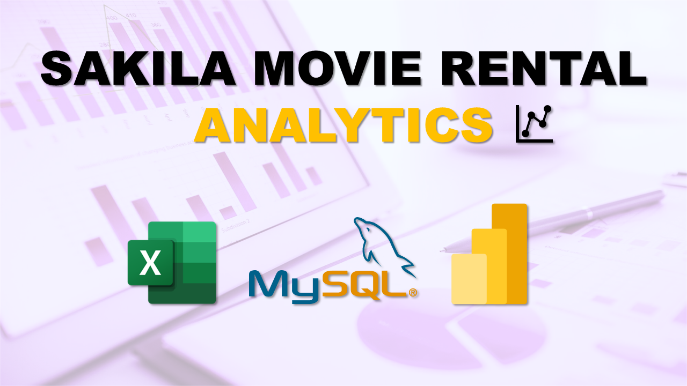

# Sakila Movie Rental Analytics Project

This repository showcases my **Sakila Movie Rental Analytics Project**, where I used **SQL, Excel, and Power BI** to uncover insights from the DVD rental business.

## 🎥 Video Walkthrough

Click the thumbnail above to watch the **unlisted video walkthrough** on YouTube.

## 📊 Project Highlights

- **SQL (MySQL):** Used for data extraction and transformation from multiple normalized tables.
- **Excel:** Conducted Exploratory Data Analysis (EDA), created pivot summaries and charts.
- **Power BI Dashboards:**
  - 📈 **Revenue & Payment Analysis** – KPIs, payment trends, revenue by category.
  - 👥 **Customer Segmentation** – High/Mid/Low engagement segments, country-wise distribution.
  - 🎬 **Rental Behavior Analysis** – Film demand, rental trends by day and category.
  - 📂 **Film & Inventory Analysis** – Film category insights, rental rates, inventory duration.
  - 🎭 **Actor Insights** – Actor popularity, genre preferences, film count by actor.
  - 🌍 **Location Analysis** – Country-level rentals, revenue, customer counts.

## 📁 Files Included
- Power BI (.pbix) file – All dashboards and data model
- Excel (.xlsx) – EDA outputs and visual summaries (optional)
- README – Project overview

---

*This project simulates a real-world analytics pipeline and demonstrates how raw data can drive strategic insights across business operations.*
